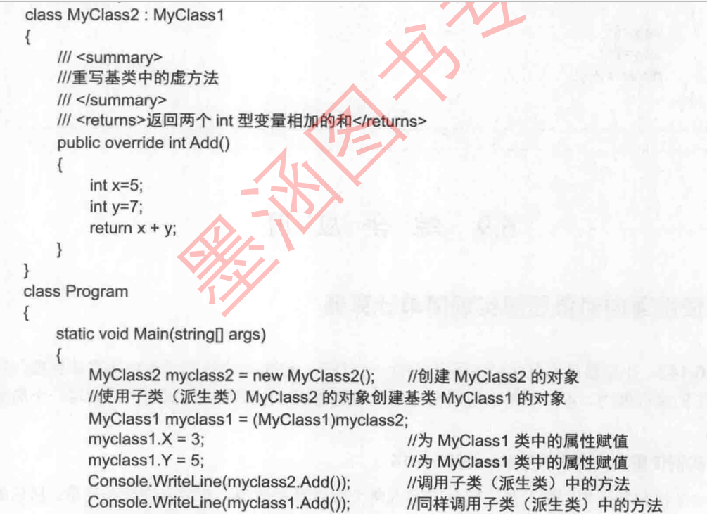

# 说明

笔者在第一份工作中，需要接触到C#语言的学习需要快速学习，应用到日常的工作中~

# c#语法基础

#### 1.数据类型

1.值类型

sbyte,short,int,long有符号整数。（8位2次方递增

byte,ushort,unit,ulong无符号整数。（8位2次方递增

float7位数,double精确到15~16位整数。浮点数默认为double，加F强制转换成float类型。

2.引用类型

object,string类属引用类型。

#### 2.运算符号

<<和>>代表向左右移位，X<<N向做移动N位，N位代表二级制位数

is 类型检查，i is int 返回bool类型。

Convert.ToInt32进行类型转换。

### 3.时间格式

### 4.字符串StringBuilder和String类的区别

### 5.类的多态

疑问点：如何使用派生类的对象创建基类对象，使基类对象可以使用派生类重写的基类方法。

实现如上图

类点：抽象类、override覆盖方法关键字、虚方法（允许被其他子类重新定义）

### 6.接口

### 7.泛型

主要泛型接口、方法、类。主要是未定义类型，等到需要调用接口/其他时在定义接口类型。

