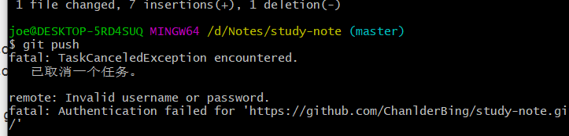

# Git

1.git配置ssh后需要更改本地仓库与远程仓库的连接方式，否则出现配置完ssh后仍然需要登录的错误操作

```
git remote -v

origin  https://github.com/xxx/xxx.git (fetch)
origin  https://github.com/xxx/xxx.git (push)

由于出现这种问题，大部分在于 git pull等操作时， HTTPS 的网络连接问题报错，可将仓库的地址由 HTTPS 改成 SSH：

git remote set-url origin git@github.com:xxx/xxx.git

执行命令行后，再次查看
git remote -v

origin  git@github.com:xxx/xxx.git (fetch)
origin  git@github.com:xxx/xxx.git (push)
```

