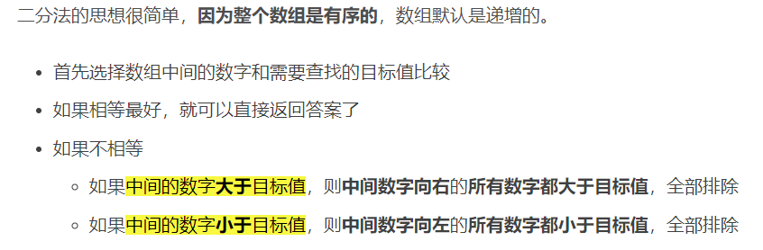

# 基础算法学习

### 1.二分查找

[^条件]: 数组必须是有序的；查找的数量必须是一个

[文章索引]: https://blog.csdn.net/qq_45978890/article/details/116094046



```
int search(int nums[], int size, int target) //nums是数组，size是数组的大小，target是需要查找的值
{
    int left = 0;
    int right = size - 1;	// 定义了target在左闭右闭的区间内，[left, right]
    while (left <= right) {	//当left == right时，区间[left, right]仍然有效
        int middle = left + ((right - left) / 2);//等同于 (left + right) / 2，防止溢出
        if (nums[middle] > target) {
            right = middle - 1;	//target在左区间，所以[left, middle - 1]
        } else if (nums[middle] < target) {
            left = middle + 1;	//target在右区间，所以[middle + 1, right]
        } else {	//既不在左边，也不在右边，那就是找到答案了
            return middle;
        }
    }
    //没有找到目标值
    return -1;
}
```

